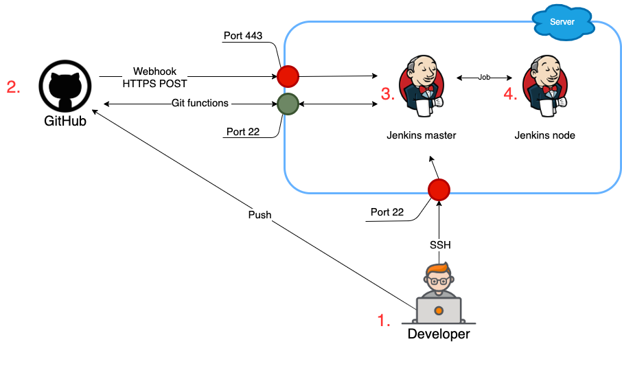

# Ansible playbooks for Jenkins

1-2. Developer push code to GitHub repository.

2-3. Push triggered GitHub webhooks and send HTTPS 

POST payload to the Jenkins URL.

3-4. Jenkins master starts job on Jenkins node.


### Step 1 - Set up VM
First, update your existing list of packages;
```
$ sudo apt update
```
Next, install Ansible;
```
$ sudo apt install ansible
```
Then put correct IP addresses in files `inventory.txt`;

### Step 2 - Create users with SSH key

For create user you need to change variables and run `init_user_admin.yml` in `/ansible_for_users` directory;

You have to replace `[...]` on your date. For example, you have `-u [USER_NAME]` replase on `-u admin`;

```
$ ansible-playbook -i inventory.txt -c paramiko init_user_admin.yml --ask-pass -u [USER_NAME] --extra-vars "ansible_sudo_pass=[USER_PASSWORD]" --extra-vars='pubkey="[USER_PUBLIC_KEY]"'
```

For create user you need to change variables and run `create_user.yml` in `/ansible_for_users` directory;

```
$ ansible-playbook create_user.yml -i inventory.txt -u [ADMIN_USER_NAME] --key-file=[PATH_TO_ADMIN_SSH_KEY] --extra-vars "ansible_sudo_pass=[ADMIN_USER_PASSWORD]" --extra-vars='upassword="[USER_PASSWORD]"' --extra-vars='pubkey="[USER_PUBLIC_KEY]"'
```

### Step 3 - Configuration VMs and installation Jenkins;

For install dependencies and setting Jenkins you need to change variables and run `main.yml` in `ansible_for_jenkins` directory;
```
$ ansible-playbook -i inventory.txt main.yml --key-file=[path_to_user_ssh_key] -u [USER_NAME] --ask-pass --extra-vars "ansible_sudo_pass=[USER_PASSWORD]" -c paramiko
```

For install dependencies and setting Jenkins Node you need to change variables and run `main_node.yml` in `ansible_for_jenkins` directory;
```
$ ansible-playbook -i inventory.txt main.yml --key-file=[path_to_user_ssh_key] -u [USER_NAME] --ask-pass --extra-vars "ansible_sudo_pass=[USER_PASSWORD]" -c paramiko
```

### Step 4 - Generate and update SSL certificates

First you have to replace `HTTP_PORT` on `443` in `/etc/default/jenkins`;
```
$ sudo nano /etc/default/jenkins
$ sudo systemctl restart jenkins
```
For generate and update SSL certificate use:
* [Genera
te SSL](https://scriptcrunch.com/create-ca-tls-ssl-certificates-keys/)
* [Configure SSL on Jenkins Server](https://devopscube.com/configure-ssl-jenkins/)

Note: Google Chrome does not work well with self-signed certificates, to solve this problem:
* [Change settings Google Crome](https://www.pico.net/kb/how-do-you-get-chrome-to-accept-a-self-signed-certificate)
* Install Mozilla Firefox

### Step 5 - Settings GitHub Webhooks for Jenkins pipelines;

[Documentation for configuration](https://www.blazemeter.com/blog/how-to-integrate-your-github-repository-to-your-jenkins-project)

### Step 6 - Settings Backup for Jenkins jobs;
[Documentation for configuration](https://devopscube.com/jenkins-backup-data-configurations/)